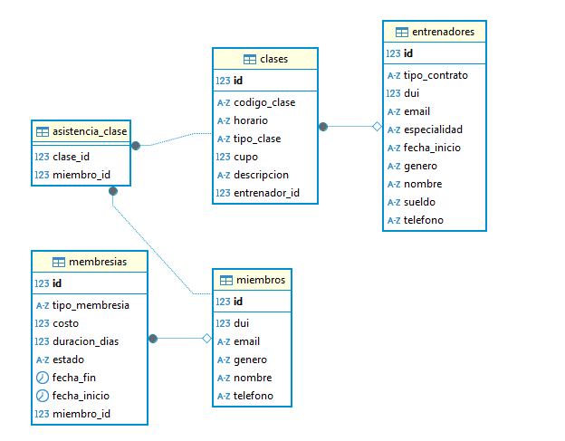

# Examen Corto
Ya cuenta con las entidades solicitadas, excepto una que sería la de __AsistenciaClase__, al ser una tabla de relación __ManyToMany__ se crea cuando se ejecuta el proyecto y se puede observar en el diagrama de la base de datos

